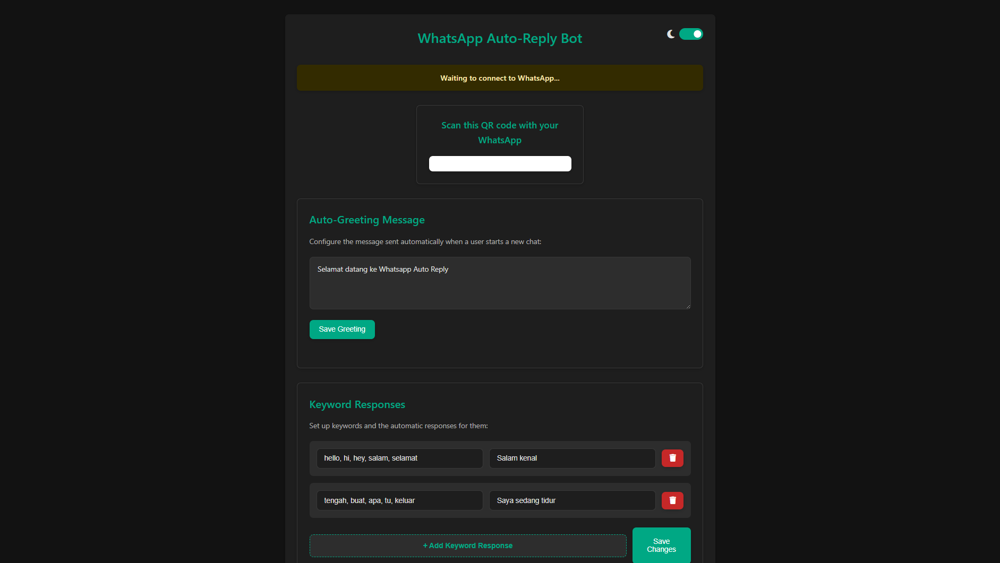

# WhatsApp Auto-Reply Bot 💬

A Node.js application that provides automatic responses to WhatsApp messages based on keywords. Features a web interface for configuration, auto-greeting messages, and light/dark mode.



## ✨ Features

- **Auto-Reply System**: Responds automatically to messages containing specific keywords
- **Auto-Greeting**: Sends a welcome message to new conversations
- **Web Interface**: Easily configure responses through a browser
- **Real-time Updates**: Monitor activity through the live log system
- **Theme Support**: Light and dark mode for comfortable viewing
- **QR Code Authentication**: Simple WhatsApp Web authentication
- **Persistence**: Saves configuration between restarts
- **Daily Reset**: Automatically resets greeting status at midnight

## 🛠️ Technologies Used

- **Node.js**: Server-side JavaScript runtime
- **Express**: Web server framework
- **Socket.IO**: Real-time communication between server and client
- **whatsapp-web.js**: WhatsApp Web API integration
- **HTML5/CSS3**: Modern user interface
- **JavaScript (ES6+)**: Client and server logic
- **LocalStorage**: Theme preference persistence

## 📁 Project Structure

```
whatsapp-autoresponder/
│
├── index.js                 # Main application file
├── package.json             # Dependencies and scripts
├── start-app.bat            # Windows launcher script
├── README.md                # Project documentation
│
└── public/                  # Web interface files
    ├── index.html           # Main interface
    ├── styles.css           # Styling with theme support
    └── (socket.io.js)       # Auto-served by socket.io


## 🚀 Setup and Installation

### Prerequisites

- Node.js (v16.x or newer)
- npm (comes with Node.js)
- A device with WhatsApp installed for scanning the QR code

### Installation Steps

1. **Clone the repository**:
   ```
   git clone https://github.com/yourusername/whatsapp-autoresponder.git
   cd whatsapp-autoresponder
   ```

2. **Install dependencies**:
   ```
   npm install
   ```

3. **Start the application**:
   - On Windows: Double-click the `start-app.bat` file
   - Or use command line: `npm start`

4. **Connect your WhatsApp**:
   - Open your browser to http://localhost:8000
   - Scan the QR code with WhatsApp on your phone
   - Once connected, the bot will start responding to messages

## ⚙️ Configuration Options

### Keyword Responses

Add keyword responses through the web interface:
- **Keywords**: Comma-separated list of trigger words
- **Response**: The message that will be sent when any keyword is detected

### Auto-Greeting Message

Configure the welcome message sent to new conversations:
- Set a personalized greeting that introduces your service
- The greeting is sent only once per day to each user

### Theme Settings

- Toggle between light and dark mode using the switch in the header
- Your preference is saved for future sessions
- Automatically detects and respects system dark mode preference

## 🌙 Theme Customization

You can customize colors by modifying the CSS variables in `styles.css`:

```css
:root {
  /* Light theme (default) */
  --primary-color: #075E54;
  --button-color: #128C7E;
  --body-bg: #f0f2f5;
  --card-bg: #fff;
  /* Add or modify other variables as needed */
}

[data-theme="dark"] {
  --primary-color: #00a884;
  --button-color: #00a884;
  --body-bg: #121212;
  --card-bg: #1e1e1e;
  /* Add or modify other variables as needed */
}
```


## 📄 License

This project is open source

## 👏 Acknowledgments

- WhatsApp Web QR
- Node.js community
- Socket.IO for real-time communications
- QR Code libraries for authentication
- Font Awesome for icons